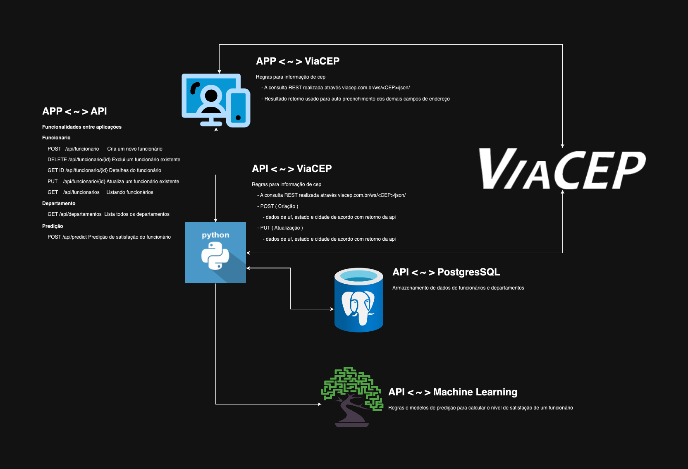

# Sistema Cadastro de Funcionário

## Fluxograma do Sistema

## Integração API ViaCEP
- A api [ViaCEP](viacep.com.br/ws/13063000/json/) é uma api externa que suporta as seguintes funções:
    - Modo geral: Retorna dados de endereço de acordo com o cep informado
    - Frontend:
        - Serviço utilizado para validação do cep e auto preenchimento dos demais campos referente ao endereço do funcionário
    - Backend:
        - Serviço utilizado para validação do cep e auto preenchimento do campos
            - UF
            - Cidade
            - Estado
        - Serviço utilizado para validar fluxos:
            - POST: Criação de um funcionário vinculado a um endereço
            - PUT: Alteração de um funcionário vinculado a um endereço

## Integração com o backend
- Para a comunicação com o backend usar o projeto [GitHub - angelozero/backend](https://github.com/angelozero/backend)

- Para execução da API acessar [README.md](https://github.com/angelozero/backend/blob/main/README.md) 

## Info Cadastro de Funcionário

O sistema de Cadastro de Funcionários permite operações básicas de criação, atualização, listagem e exclusão de funcionários associados a um departamentos específico.

Cada funcionário é identificado por um nome, e-mail e está vinculado a um departamento.

Os principais recursos incluem:

- Listagem de Funcionários: Permite visualizar uma lista paginada de funcionários com opções de filtragem por nome, e-mail e departamento.
- Criação de Funcionários: Permite adicionar novos funcionários associados a um departamento específico.
- Detalhes do Funcionário: Oferece informações detalhadas sobre um funcionário específico com base no seu ID.
- Atualização de Funcionários: Permite modificar as informações de um funcionário existente, incluindo nome, sobrenome, e-mail, departamento e dados do endereço.
- Exclusão de Funcionários: Permite remover um funcionário com base no seu ID.

Além disso, o sistema oferece recursos relacionados a departamentos, como:

- Listagem de Departamentos: Permite visualizar uma lista de todos os departamentos disponíveis.

Essa sistema proporciona um meio eficiente de gerenciar funcionários e departamentos em um sistema de RH ou em qualquer outro contexto organizacional.
- Cadastro de um funcionário:
    

- Edição de um funcionário:
    